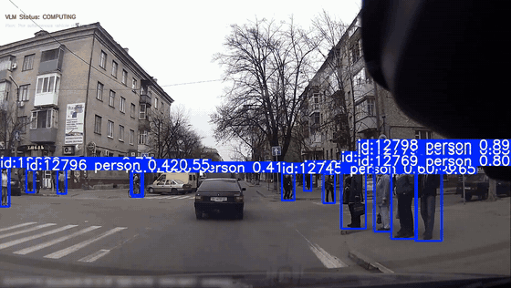
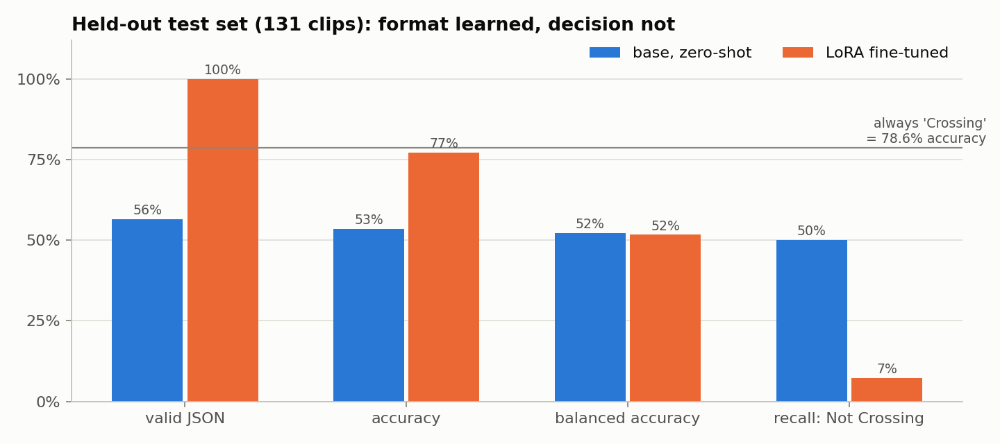
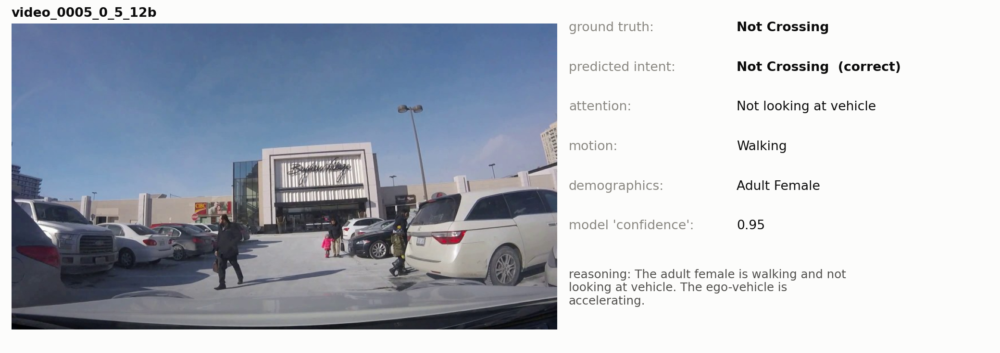
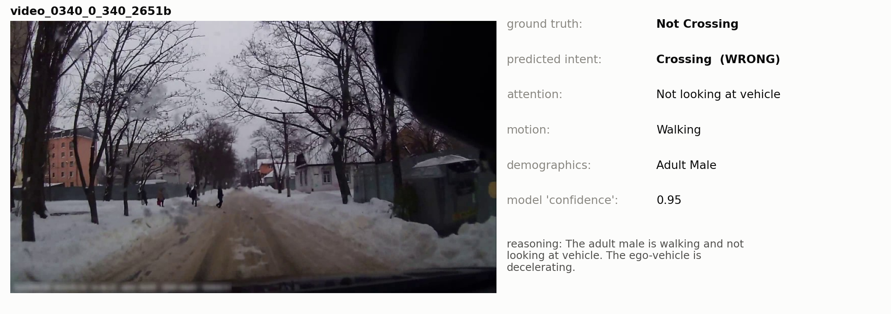
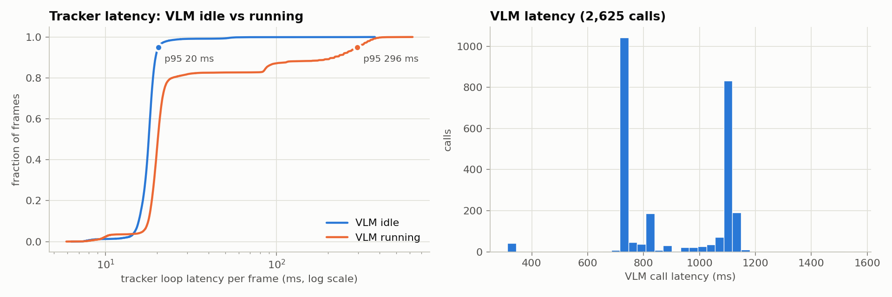
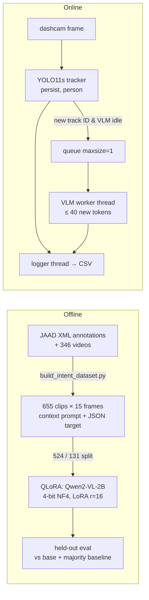

# Pedestrian Crossing-Intent Prediction with a Vision-Language Model (JAAD)

Can a 2B-parameter vision-language model watch a dashcam clip and say whether a pedestrian is about to cross, with a structured explanation, inside a real-time driving loop? This project builds the whole chain and measures it honestly:
- a JAAD clip-and-prompt dataset;
- QLoRA fine-tuning of Qwen2-VL-2B;
- a held-out evaluation against baselines;
- an asynchronous tracker + VLM architecture with telemetry over all 346 JAAD videos.

<p align="center"></p>
<p align="center"><sub>YOLO11s person tracking as the fast loop. The VLM runs in a background thread when a new pedestrian appears (status: COMPUTING).</sub></p>

## Results

**Held-out test set (131 clips never used in training).**

| | Base Qwen2-VL-2B (zero-shot) | **QLoRA fine-tuned** |
|---|---|---|
| Valid JSON output | 56.5% | **100%** |
| Accuracy (always "Crossing" = **78.6%**) | 53.4% | 77.1% |
| Balanced accuracy | 52.2% | 51.6% |
| Recall on "Not Crossing" (28 clips) | 50.0% | 7.1% |

Fine-tuning taught the output **format** perfectly but **not the decision**. The model predicts "Crossing" for 125 of 131 clips, no better than the majority class. The same holds when clips are encoded with the training-time settings (75.6% accuracy, 50.7% balanced). The notebook traces the causes:
- **Loss masking.** Only padding is masked, so ~1,440 video placeholder tokens and the prompt are training targets, and the answer is ~5% of the loss.
- **Class imbalance.** 73% of training clips are "Crossing".
- **Short context.** Each clip is 0.5 s, seen as 4 frames.
- **Weak targets.** The `confidence_score` is random (0.85–0.99) and the `reasoning` field is templated.

<p align="center"></p>

Two held-out clips with the model's raw output. The first is one of only two correct "Not Crossing" answers. The second is a typical error, where the model says "Crossing" by default:

<p align="center"></p>
<p align="center"></p>

**Real-time architecture (346 videos, 79,344 frames).**

| Tracker loop latency | p50 | p95 | p99 |
|---|---|---|---|
| VLM idle | 17.9 ms | 20.4 ms | 28.1 ms |
| VLM running on the same GPU | 20.2 ms | **296 ms** | 367 ms |

The VLM (p50 824 ms per call) never blocks the tracker, but sharing the GPU inflates the tracker's tail latency about 14×. The VLM fired 2,625 times, once every ~30 frames, and was busy for roughly half of all frames.

<p align="center"></p>

## How it works



## Repository layout

```
pedestrian_intent_vlm.ipynb    walkthrough: dataset, QLoRA, held-out evaluation, async architecture + telemetry
src/build_intent_dataset.py    JAAD -> 15-frame clips + context prompts + JSON targets (run inside a JAAD clone)
src/train_lora_v2.py           QLoRA fine-tuning (4-bit NF4, LoRA r=16/alpha=32, 5 epochs)
src/eval_intent_heldout.py     held-out evaluation: base vs LoRA, accuracy / balanced accuracy / JSON validity
src/async_tracker_vlm.py       YOLO11s tracker + asynchronous VLM worker + background CSV logger
src/render_dashboards.py       per-clip "chain-of-thought" dashboards
src/master_evaluator.py, src/v1_baseline_evaluator.py, src/calculate_benchmarks.py   original evaluation scripts
splits/                        v2_train.jsonl (524) and v2_test.jsonl (131)
results/metrics/               held-out predictions and summaries, async-pipeline telemetry log, LoRA trainer state
```

## Quick start

```bash
git clone https://github.com/ykotseruba/JAAD && cd JAAD && bash download_clips.sh     # videos -> JAAD_clips/
cp -r /path/to/this/repo/{src,splits} . && pip install -r /path/to/this/repo/requirements.txt
python src/build_intent_dataset.py          # -> v2_training_clips/ + qwen_v2_training_data.jsonl
python src/train_lora_v2.py                 # -> qwen-pedestrian-intent-v2/
python src/eval_intent_heldout.py --mode lora && python src/eval_intent_heldout.py --mode base
python src/async_tracker_vlm.py             # needs a merged checkpoint in models/Qwen2-VL-2B-Merged
```

## Next steps

1. Mask the loss to the assistant answer only. Rebalance classes or weight the intent token.
2. Use longer clips (1.5–2 s at 5–10 fps), predict the intent *first*, and take confidence from the intent token's probability.
3. Use a video-disjoint split: 101 of the 131 test clips currently share a source video with training clips.
4. Give the VLM its own CUDA stream priority or device, or run it through the TensorRT-LLM bf16 engine that was built, to protect tracker latency.

## Data & licenses

- **JAAD**: Rasouli, Kotseruba & Tsotsos, *Are They Going to Cross? A Benchmark Dataset and Baseline for Pedestrian Crosswalk Behavior*, ICCVW 2017. The annotations and interface are MIT and the videos CC BY 4.0. `splits/` contains labels derived from the JAAD annotations; no videos are redistributed.
- **Qwen2-VL-2B-Instruct** (Apache-2.0) and **Ultralytics YOLO11** (AGPL-3.0) are used as dependencies.
- Code: MIT (see [LICENSE](LICENSE)).
